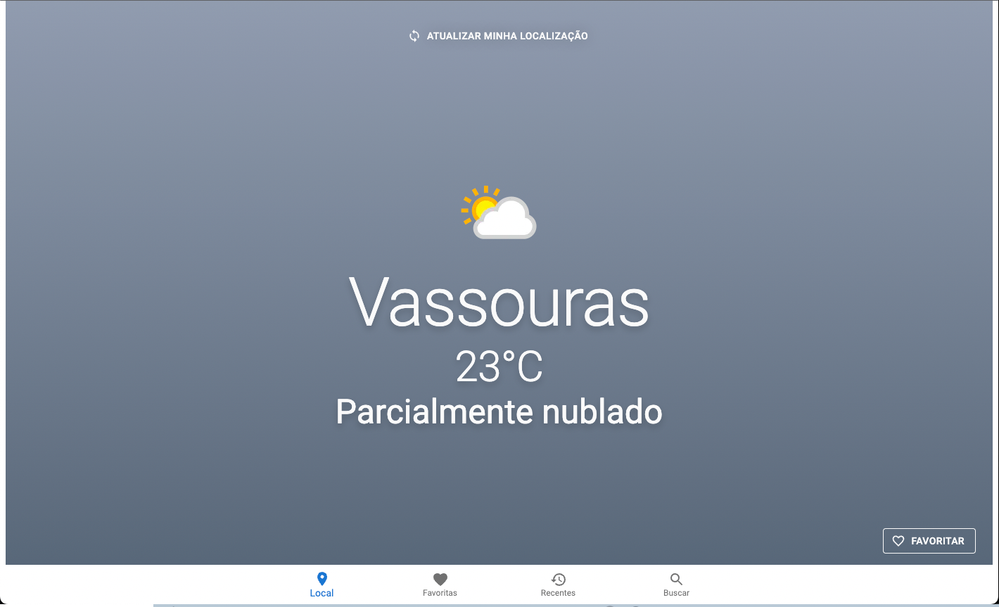
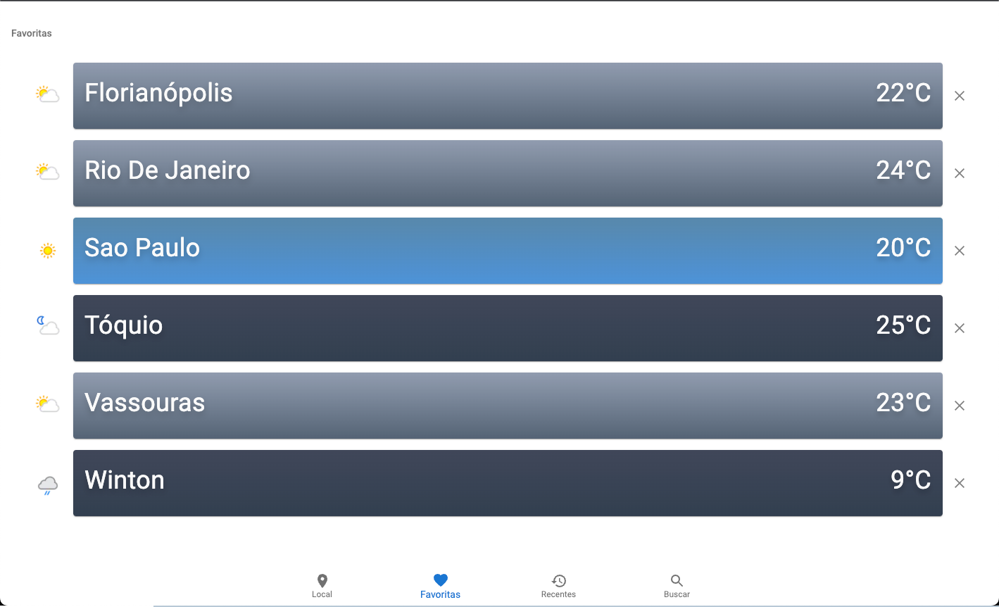
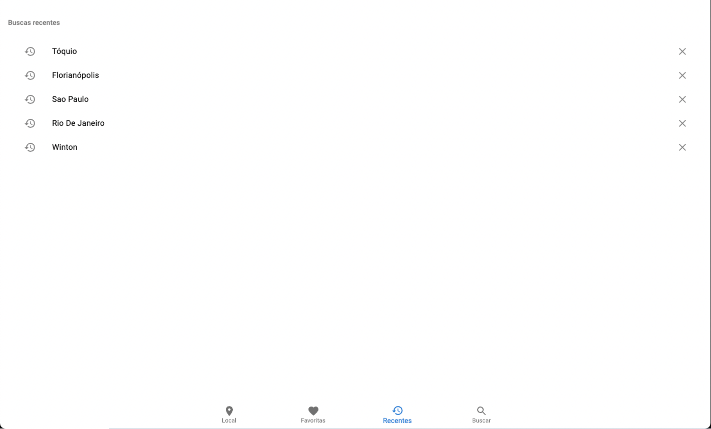
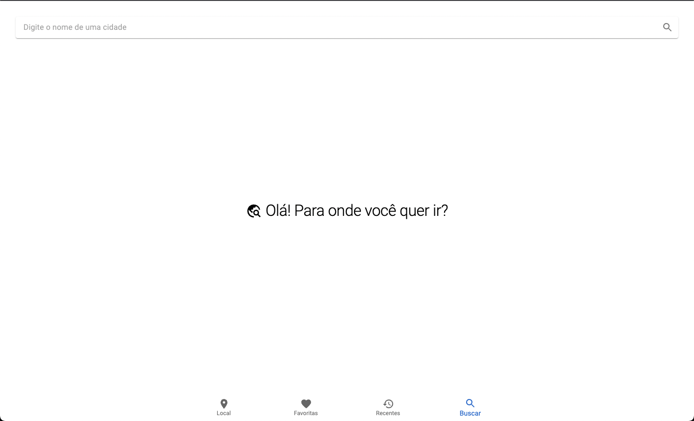
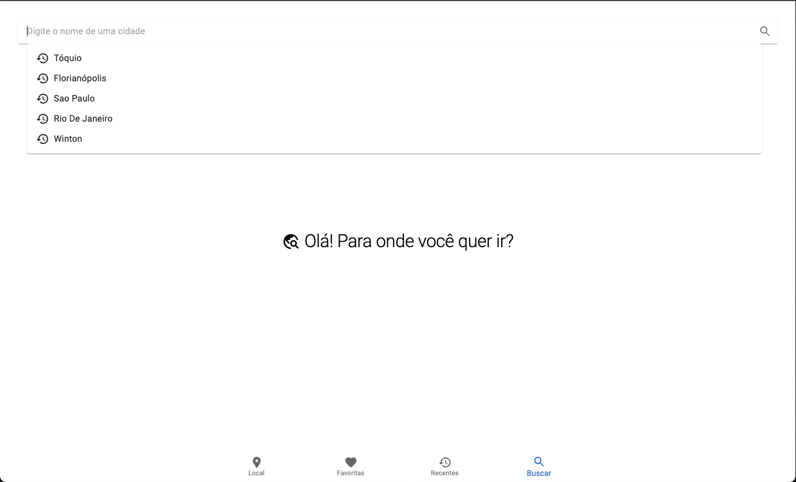
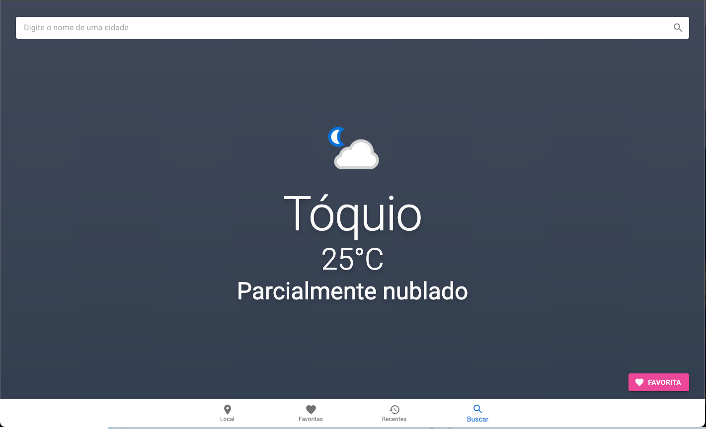

# Clima

## Aplicação para consultar o clima de cidades

Experimente: 🔗 [clima.nasc.dev](https://clima.nasc.dev)

### Objetivos técnicos

1. Feita com Next.js e TypeScript. ✅
2. Desenvolvida em cima da Material UI para a estilização dos componentes. ✅
3. Utiliza o Redux para o gerenciamento de estado. ✅
4. Integra a [WeatherAPI](https://www.weatherapi.com) para fornecer os dados climáticos. ✅ 
5. Testes unitários usando RTL (React Testing Library) e testes de integração usando Cypress. (Incompleto) 🚧
6. Utiliza ESLint para garantir a qualidade do código e seguir as melhores práticas de desenvolvimento. ✅ 
7. Utiliza SSR. ✅

### Funcionalidades

1. A página inicial exibe as informações meteorológicas da localização atual do usuário. ✅
  - Nome da cidade, temperatura atual, descrição do clima e um ícone representando o clima.
  - A cor de fundo da página é adaptada de acordo com o clima da localização atual.
  - Para melhorar a experiência, a identificação da localização é feita pelo provedor de internet da pessoa que está acessando. Caso o provedor não forneça a informação, ou a pessoa queira atualizar para aumentar a precisão, o botão "Atualizar minha localização" está disponível e utiliza a Geolocation API.
  - As informações climáticas sobre a localização atual da pessoa são armazenadas em Cookie que possui validade de 1 hora. O objetivo é reduzir significantemente o número de requisições desnecessárias a Weather API. Se a pessoa acessar a aplicação depois de 1 hora, apenas o botão "Atualizar minha localização" é exibido e, ao ser clicado, trará as informações climáticas mais atualizadas e renovará o Cookie.
  - É possível favoritar a localização atual.

2. É possível pesquisar por uma cidade específica e obter as informações meteorológicas dessa cidade. ✅
  - A barra de pesquisa exibirá sempre as 5 últimas buscas, como sugestões.
  - É possível favoritar a cidade pesquisada.
  - A cor de fundo da página é adaptada de acordo com o clima atual da cidade pesquisada.
3. É possível acessar o histórico das cidades pesquisadas recentemente. ✅
  - Esse histórico é armazenado no Local Storage, o que permite que a pessoa não o perca caso saia da aplicação. É possível também excluir qualquer pesquisa do histórico.
4. Sistema de favoritos, permite salvar suas cidades preferidas. ✅
  - Toda cidade favoritada será listada na página "Favoritas".
  - Na lista é possível ver um resumo das informações climáticas de cada cidade favorita.
  - A cor de fundo de cada cidade da lista é adaptada de acordo com o clima atual da cidade.
  - Os favoritos são armazenados no Local Storage, o que permite que a pessoa não o perca caso saia da aplicação. É possível desfavoritar qualquer cidade da lista.
  - Cada favorito é armazenado com a data e o horário da última atualização. Caso a pessoa acesse a página de favoritos e uma ou mais cidades tiverem mais de 1 hora desde a última atualização, apenas essas cidades serão atualizadas. Isso reduz significantemente o número de requisições desnecessárias a Weather API.

### Capturas de tela

|Inicial (Localização atual)|Favoritas|
|:-:|:-:|
|||

|Recentes (Histórico de buscas)|Buscar|
|:-:|:-:|
|||

|Sugestões de busca (Buscar)|Cidade pesquisada (Buscar)|
|:-:|:-:|
|||

